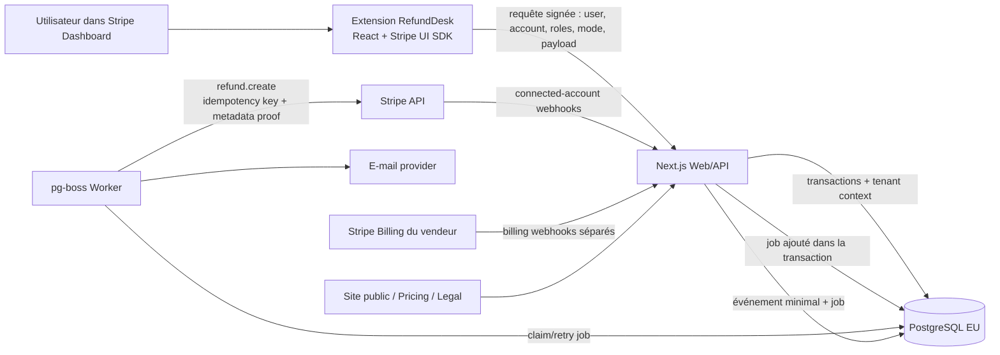
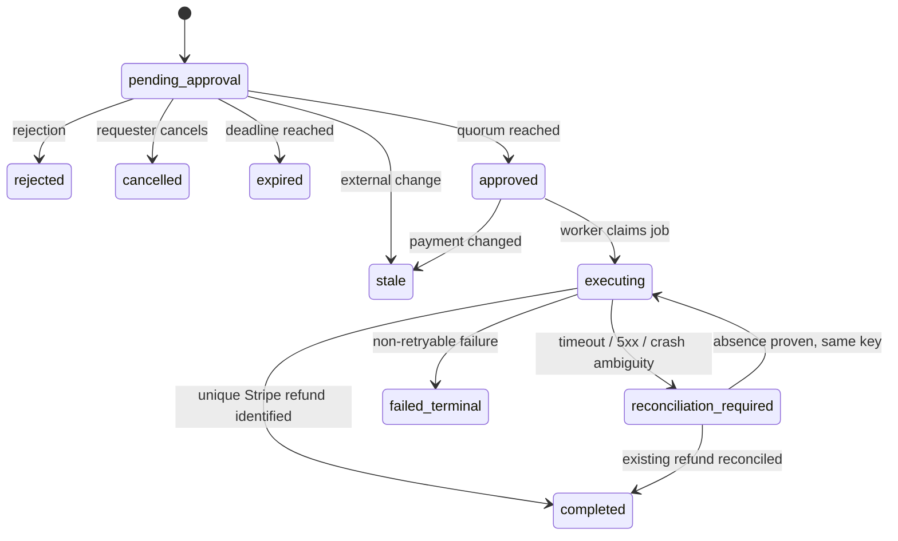

# RefundDesk — cahier des charges et prompt maître pour Codex

> Version : 1.0  
> Recherche technique vérifiée le : 25 juillet 2026  
> Statut : MVP autorisé uniquement après validation du spike technique de phase 0  
> Nom de travail : **RefundDesk**  
> Langue du produit v1 : anglais  
> Langue de ce document : français, avec identifiants techniques en anglais

Ce fichier est la source de vérité du projet. Il doit être placé à la racine d’un dossier de projet vide, puis donné intégralement à Codex. Les décisions marquées **verrouillées** ne doivent pas être remplacées silencieusement par une autre technologie ou une autre portée.

---

## Prompt maître à donner à Codex

Copier le texte ci-dessous dans une nouvelle tâche Codex ouverte dans le dossier qui contient ce fichier :

```text
Lis entièrement @REFUNDDESK_CODEX_BUILD_SPEC.md avant toute modification.

Ta mission est de construire le MVP production-ready de RefundDesk décrit dans ce fichier, pas seulement une maquette ou un scaffold. Travaille comme lead engineer responsable de l’architecture, de l’implémentation, des tests, de la sécurité et de la documentation.

Règles de travail :
1. Inspecte d’abord le dossier et vérifie les documentations officielles actuelles pour toute API ou version qui aurait pu changer.
2. Crée immédiatement un PLANS.md découpé selon les phases du cahier des charges, puis un AGENTS.md concis contenant les commandes réelles, les invariants financiers, les conventions et la définition de “terminé”.
3. Exécute la phase 0 avant le reste. Si un critère bloquant de phase 0 échoue réellement, arrête l’implémentation et fournis les preuves, la cause et l’alternative la plus petite. Sinon, continue sans demander une validation intermédiaire.
4. Utilise des sous-agents en parallèle quand cela accélère utilement la recherche Stripe, les tests ou la revue de sécurité, tout en gardant les décisions et l’intégration dans l’agent principal.
5. Utilise les skills officiels `$stripe-docs` et `$stripe-best-practices` s’ils sont disponibles, puis la documentation Stripe officielle. N’invente jamais un comportement Stripe et vérifie les points sensibles, lorsque possible, par un test en sandbox.
6. Ne remplace pas la stack verrouillée sans blocage démontré. Si une version exacte est obsolète, choisis la dernière version stable compatible, verrouille-la dans le lockfile et consigne le changement dans un ADR.
7. Implémente les invariants dans le domaine ET dans la base de données lorsque c’est possible. Toutes les opérations financières doivent être idempotentes, rejouables et auditables.
8. Après chaque phase : exécute les tests concernés, mets PLANS.md à jour et relis le diff. Ne laisse pas de faux tests, marqueurs de travail critiques non résolus, mocks actifs en production ou chemins heureux non vérifiés.
9. Utilise des valeurs factices et des adaptateurs locaux lorsqu’une clé ou un compte externe manque. Ne demande à l’utilisateur que les secrets ou actions humaines réellement indispensables.
10. Tu peux initialiser un dépôt Git local et faire des commits de jalon, mais ne pousse rien, ne publie pas l’application Stripe, ne crée pas de ressources payantes et ne déploie pas en production sans autorisation explicite.
11. N’utilise jamais de données client réelles. Ne journalise ni e-mail, ni justification, ni payload Stripe complet, ni secret.
12. À la fin, fournis : architecture réellement obtenue, commandes de démarrage, variables manuelles restantes, résultats de tests, limites connues, procédure de test sandbox et checklist avant publication.

Commence maintenant. Ne t’arrête pas après la planification ou le scaffold si la phase 0 est validée.
```

---

## 1. Résultat attendu

### 1.1 Proposition de valeur

RefundDesk est une Stripe App qui ajoute un workflow contrôlé aux remboursements :

1. un membre du support demande un remboursement depuis la fiche d’un paiement ;
2. un autre utilisateur autorisé l’approuve ou le refuse ;
3. le backend RefundDesk exécute le remboursement dans Stripe ;
4. toutes les décisions et tentatives restent auditables ;
5. les remboursements réalisés directement en dehors de RefundDesk sont signalés.

Promesse publique correcte :

> **Require approval before your team issues Stripe refunds, then keep a complete audit trail.**

Promesse interdite :

> “RefundDesk blocks every possible refund.”

RefundDesk ne peut pas empêcher une personne qui conserve un droit natif de remboursement dans Stripe, ni une autre clé API ou intégration, d’effectuer directement un remboursement. Il fournit un chemin contrôlé et détecte les exceptions.

### 1.2 Client initial

Entreprise utilisant Stripe avec :

- au moins trois personnes dans les équipes support, opérations ou finance ;
- des remboursements suffisamment fréquents ou des paniers suffisamment élevés pour justifier un contrôle ;
- une volonté de retirer le droit natif de remboursement aux demandeurs ;
- un administrateur Stripe capable d’installer et configurer l’application.

### 1.3 Objectif du MVP

Un compte Stripe doit pouvoir installer RefundDesk en sandbox ou en mode test, terminer l’onboarding, demander un remboursement partiel ou total, obtenir l’approbation d’une autre personne, exécuter exactement un remboursement et exporter la piste d’audit.

### 1.4 Distribution

Le canal principal est le **Stripe App Marketplace** : découverte, installation et usage ont lieu dans un écosystème où l’intention existe déjà. Le site public sert surtout la confiance, la review Marketplace, la documentation et quelques pages à intention forte. Il ne doit exiger ni blog continu, ni backlinks massifs, ni dépendance à un SEO/GEO agressif.

### 1.5 Hors périmètre v1

Ne pas construire dans le MVP :

- Stripe Connect pour gérer les sous-comptes d’une plateforme cliente ;
- remboursements par ligne de facture ou credit notes ;
- décisions automatiques par IA ;
- Slack, Microsoft Teams ou Zendesk ;
- pièces jointes et stockage de documents ;
- conversion FX pour comparer des seuils entre devises ;
- application mobile ;
- SSO propre à RefundDesk ou comptes/mots de passe externes ;
- blocage universel des remboursements effectués par d’autres API ;
- moteur générique d’approbation pour payouts, transfers ou invoices ;
- tableau de bord externe complet ;
- freemium.

---

## 2. Décisions techniques verrouillées

| Domaine | Choix |
|---|---|
| Runtime | **Node.js 24 LTS**, déclaré dans `.nvmrc`, `package.json#engines` et les images de build |
| Langage | **TypeScript strict** partout ; aucune nouvelle source JavaScript non typée |
| Monorepo | **pnpm workspaces**, sans Turborepo au départ |
| Extension Stripe | React + TypeScript + `@stripe/ui-extension-sdk` + composants UI officiels Stripe |
| Web/API | **Next.js 16.2 Active LTS**, au minimum `16.2.11`, App Router et runtime Node |
| Base | **PostgreSQL 18** géré, dans une région UE |
| Accès base | **Prisma ORM 7 stable** avec `@prisma/adapter-pg` et migrations SQL versionnées |
| Jobs | **pg-boss 12 stable**, dans un processus séparé utilisant le même PostgreSQL |
| Validation | **Zod** aux frontières HTTP, environnement et jobs |
| Stripe | SDK officiel `stripe` côté serveur ; authentification Stripe App de type **platform key** |
| E-mail | Adaptateur `NotificationProvider`, implémentation Brevo Transactional Email et Mailpit en local |
| Logs | Pino JSON structuré avec redaction stricte |
| Erreurs | Sentry côté serveur/worker uniquement, sans données personnelles |
| Tests | Vitest, Testing Library, Testcontainers PostgreSQL, Playwright et Stripe CLI/sandbox |
| CI | GitHub Actions : format, lint, types, tests unitaires/intégration, build, audit des dépendances |
| Hébergement cible | Render, région **Frankfurt**, un web service, un background worker et un PostgreSQL payant sur réseau privé |

### 2.1 Pourquoi cette stack

- Stripe impose TypeScript/React et son UI Extensions SDK pour l’interface embarquée.
- Next.js regroupe le site public, les pages de prix/légales et les routes backend sans créer un frontend et une API séparés. La version doit inclure les correctifs de sécurité de juillet 2026.
- Un service Node persistant convient mieux aux webhooks et au worker qu’une architecture uniquement Edge/serverless.
- PostgreSQL fournit transactions, contraintes, verrous, sauvegardes et isolation multi-tenant.
- pg-boss évite Redis tout en apportant retries, déduplication, dead-letter queues, planification et insertion de jobs dans la transaction Prisma existante.
- Prisma 7 est la branche stable recommandée pour la production en juillet 2026. Drizzle n’est pas retenu car ses guides PostgreSQL actuels demandent encore les paquets `@rc`.
- L’authentification Stripe existante évite Auth0, Clerk, Supabase Auth et une seconde identité utilisateur.

### 2.2 Règles de versions

- N’utiliser que des versions **stables**, jamais `canary`, `beta`, `rc` ou une dépendance non maintenue.
- Utiliser Next.js `16.2.11` au minimum et rester sur la dernière correction stable de la branche Active LTS 16.2 au moment de l’initialisation.
- Résoudre les dernières versions stables compatibles de Prisma 7 et pg-boss 12, puis les verrouiller dans `pnpm-lock.yaml`.
- Épingler explicitement la version de l’API Stripe acceptée par le SDK installé et la consigner dans `docs/adr/`.
- Ne pas copier aveuglément une version d’API depuis un exemple de documentation.
- Les migrations Prisma de production sont générées puis relues en SQL. `prisma db push` est réservé au prototypage local et interdit en production.

### 2.3 Services volontairement absents

Pas de Redis, Kafka, Kubernetes, microservices, GraphQL, tRPC, Auth.js, système de feature flags externe ou data warehouse dans le MVP.

---

## 3. Architecture



### 3.1 Frontières

**Extension Stripe**

- affiche l’interface ;
- récupère le contexte du paiement et l’identité de l’utilisateur ;
- récupère l’e-mail courant avec l’API Stripe autorisée ;
- fait signer par Stripe le payload transmis au backend ;
- utilise uniquement React, le SDK et les composants UI Extensions autorisés ; aucun HTML arbitraire, cookie, `localStorage` ou secret ;
- ne contient aucun secret et n’exécute jamais directement un remboursement.

**Web/API**

- vérifie signatures, identité, compte, mode et rôles ;
- applique autorisation, validation, quotas et politiques ;
- réalise les transactions métier ;
- reçoit et authentifie les webhooks ;
- crée les sessions Billing ;
- sert le site public et les pages légales.

**Worker**

- exécute les effets externes ;
- crée les remboursements avec une clé d’idempotence ;
- envoie les notifications ;
- réconcilie les webhooks ;
- expire les demandes et purge les données arrivées à échéance.
- utilise l’adaptateur de transaction Prisma officiellement supporté par pg-boss afin que transition métier, audit et création du job committent ensemble ;
- possède des files séparées pour exécution financière, webhooks, e-mails et maintenance, avec concurrence/rate limit distincts.

**PostgreSQL**

- source de vérité des demandes, décisions, abonnements, événements et journaux ;
- ne stocke aucune donnée de carte et le minimum de données du client final ;
- protège les accès inter-tenant par contraintes, repositories typés et RLS avant production.

### 3.2 Topologie de déploiement

- un environnement staging et un environnement production entièrement séparés ;
- dans chaque environnement : un service web, un background worker et un PostgreSQL payant Render, tous créés en région `Frankfurt` ;
- trafic base via l’URL privée Render ; aucune base gratuite ni stockage local persistant en production ;
- migrations exécutées une seule fois par une release command avant le démarrage de la nouvelle version ;
- le worker pg-boss utilise une connexion PostgreSQL persistante compatible `LISTEN/NOTIFY` ; ne pas interposer un pooler en mode transaction tel qu’un PgBouncer mal configuré ;
- sauvegardes automatiques/PITR activés selon le plan retenu, avec restauration testée avant lancement ;
- `render.yaml` décrit l’infrastructure sans contenir de secret ;
- la région Render d’un service ne se modifie pas après création : vérifier `Frankfurt` avant toute création payante.

Render fournit une région UE mais reste un fournisseur américain. Le MVP vise un hébergement des données en UE, pas une souveraineté juridique absolue. Si une exigence contractuelle impose un fournisseur européen, conserver l’architecture Docker/PostgreSQL portable et migrer ultérieurement vers OVHcloud ou Scaleway via un ADR dédié.

---

## 4. Structure du dépôt

```text
refunddesk/
├─ AGENTS.md
├─ PLANS.md
├─ README.md
├─ package.json
├─ pnpm-lock.yaml
├─ pnpm-workspace.yaml
├─ tsconfig.base.json
├─ .env.example
├─ .gitignore
├─ .nvmrc
├─ docker-compose.yml
├─ apps/
│  ├─ stripe-app/
│  │  ├─ stripe-app.json
│  │  ├─ stripe-app.dev.json
│  │  ├─ package.json
│  │  └─ src/views/
│  ├─ platform/
│  │  ├─ app/
│  │  ├─ src/
│  │  └─ package.json
│  └─ worker/
│     ├─ src/tasks/
│     └─ package.json
├─ packages/
│  ├─ domain/
│  ├─ contracts/
│  ├─ db/
│  ├─ stripe-adapter/
│  ├─ notifications/
│  ├─ observability/
│  └─ config/
├─ docs/
│  ├─ adr/
│  ├─ threat-model.md
│  ├─ stripe-review-checklist.md
│  ├─ sandbox-test-plan.md
│  ├─ operations-runbook.md
│  └─ data-retention.md
├─ infra/
│  ├─ Dockerfile.platform
│  ├─ Dockerfile.worker
│  └─ render/
├─ render.yaml
└─ .github/workflows/
```

`packages/domain` ne dépend ni de Next.js, ni de Stripe, ni de Prisma. Il contient les règles et transitions testables en mémoire. Les adaptateurs dépendent du domaine, jamais l’inverse. `packages/db` contient `schema.prisma`, les migrations relues en SQL et les repositories tenant-scoped.

---

## 5. Surfaces produit

### 5.1 Onboarding Stripe

Vue `onboarding` :

1. expliquer honnêtement la limite de contournement ;
2. confirmer que les demandeurs n’auront pas de droit natif de remboursement ;
3. enregistrer l’administrateur courant comme premier approbateur ;
4. choisir la politique initiale ;
5. afficher le statut test/live et la période d’essai ;
6. fournir un test guidé en sandbox ;
7. marquer l’onboarding terminé.

Le compte doit être utilisable sans créer un mot de passe RefundDesk.

### 5.2 Fiche d’un paiement

Viewport `stripe.dashboard.payment.detail` :

- résumé non persistant du paiement ;
- montant restant remboursable ;
- montant total ou partiel, toujours en unité monétaire mineure côté domaine ;
- motif Stripe : `duplicate`, `fraudulent`, `requested_by_customer` ;
- catégorie interne optionnelle ;
- justification obligatoire de 10 à 2 000 caractères ;
- avertissement spécifique avant le motif `fraudulent` ;
- aperçu du nombre d’approbations requis ;
- bouton `Request refund` ;
- état de la demande active si elle existe.

Une seule demande non terminale est autorisée simultanément par paiement et environnement.

Le verrou de paiement reste également actif lorsqu’un remboursement Stripe est `pending` ou `requires_action`, même si le workflow d’approbation est déjà `completed`.

### 5.3 Tiroir global

Viewport `stripe.dashboard.drawer.default` :

- onglet `Awaiting my approval` ;
- onglet `My requests` ;
- onglet `All activity` pour les approbateurs ;
- alertes de remboursements effectués hors workflow ;
- accès à l’export CSV et à la facturation ;
- pagination par curseur.

### 5.4 Paramètres

Vue `settings` :

- approbateurs connus ;
- politique à une ou deux approbations ;
- seuils par devise ;
- durée d’expiration, 7 jours par défaut ;
- notifications e-mail ;
- rétention ;
- abonnement ;
- lien support, confidentialité et documentation ;
- état de connexion et procédure de désinstallation.

Les modifications de politique exigent un rôle Stripe Administrator signé et créent un événement d’audit.

### 5.5 Site public minimal

Routes indexables :

- `/`
- `/pricing`
- `/security`
- `/privacy`
- `/terms`
- `/support`
- `/docs`
- `/stripe-refund-approval-workflow`
- `/how-to-require-approval-before-stripe-refunds`
- `/stripe-refund-analyst-vs-two-person-approval`

Le site doit rester statique autant que possible. Aucun blog ou CMS n’est requis.

---

## 6. Identité, autorisation et rôles

### 6.1 Authentification

Toutes les opérations venant de l’extension sont des requêtes `POST` protégées par `fetchStripeSignature`. Le client utilise un helper unique qui construit l’enveloppe signable et le corps HTTP dans l’ordre exact exigé par le SDK Stripe.

Les valeurs additionnelles ordinaires acceptées par `fetchStripeSignature` étant scalaires, les commandes complexes sont sérialisées en JSON canonique dans une chaîne signée. Exemple indicatif :

```json
{
  "operation": "refund_request.create",
  "request_nonce": "uuid",
  "mode": "test",
  "resource_id": "pi_...",
  "command_json": "{\"amount_minor\":\"1250\",\"currency\":\"eur\",\"reason\":\"requested_by_customer\",\"justification\":\"...\"}",
  "stripe_roles": [],
  "user_id": "usr_...",
  "account_id": "acct_..."
}
```

Le serveur :

1. lit le **corps brut** une seule fois ;
2. vérifie `Stripe-Signature` avec le signing secret de l’application et exactement le payload/ordre documenté ;
3. refuse les timestamps hors tolérance ;
4. parse ensuite l’enveloppe et `command_json` avec les schémas Zod propres à la route ;
5. refuse tout champ inconnu et toute représentation non canonique ;
6. lie `account_id`, `user_id`, `mode`, ressource et tenant ;
7. vérifie l’autorisation de l’opération ;
8. applique idempotence et rate limit.

Le tableau `stripe_roles` doit utiliser la clé spéciale documentée par Stripe afin que Stripe confirme que les rôles appartiennent réellement au `user_id`. Une simple valeur de rôle envoyée par le client n’est jamais digne de confiance. Les tests de contrat doivent verrouiller l’ordre exact de sérialisation : ne pas appliquer un `JSON.stringify` arbitraire à un objet reconstruit côté serveur.

Les UI extensions Stripe s’exécutent dans un iframe sandboxé dont l’origine peut être `null`. Uniquement sur les routes signées appelées par l’extension :

- répondre aux pré-requêtes `OPTIONS` ;
- utiliser `Access-Control-Allow-Origin: *` sans cookies ni credentials navigateur ;
- limiter méthodes et headers à ceux réellement employés ;
- considérer la signature Stripe, jamais CORS, comme le mécanisme d’authentification ;
- ne jamais appliquer cette wildcard aux routes publiques non authentifiées ou aux pages Billing.

### 6.2 Autorisations

- **Requester** : tout utilisateur du compte ayant accès à l’application et dont l’identité signée est valide.
- **Approver par défaut** : utilisateur dont le rôle signé contient `Administrator`.
- **Named approver** : utilisateur déjà observé dans l’application et explicitement autorisé par un administrateur.
- **Billing/settings admin** : rôle Stripe `Administrator` signé.
- Les rôles custom Stripe ne doivent pas être supposés disponibles pour une app publique.

### 6.3 Invariants

- Le demandeur ne peut jamais approuver sa propre demande.
- Une personne ne peut prendre qu’une décision par demande.
- Un rôle affiché dans l’UI ne suffit jamais à autoriser le backend.
- Un utilisateur d’un tenant ne peut ni lire ni agir sur un autre tenant.
- Le mode test/sandbox ne peut jamais déclencher une opération live.
- L’état d’abonnement et les limites sont contrôlés côté serveur.
- Une désinstallation désactive immédiatement toute nouvelle action et tout job non exécuté.
- Un kill switch global et un kill switch par tenant peuvent suspendre toute nouvelle exécution juste avant l’appel Stripe. Ils ne doivent jamais arrêter la réception des webhooks, la réconciliation ou l’export d’audit.

### 6.4 E-mail

Demander la permission `user_email_read`, obtenir l’e-mail du Dashboard via l’utilitaire Stripe, puis l’inclure dans un payload signé de synchronisation.

Stockage :

- e-mail chiffré avec AES-256-GCM et version de clé ;
- HMAC normalisé séparé pour les recherches/contraintes uniques ;
- jamais d’e-mail dans les logs, événements analytics ou Sentry.

---

## 7. Politiques d’approbation

### 7.1 Politique initiale

- Une approbation humaine obligatoire pour chaque remboursement.
- Aucune auto-approbation dans le MVP.
- Une demande expire après 7 jours si elle n’est pas approuvée.

### 7.2 Offre Team

Un compte Team peut configurer, par devise :

- une approbation sous un seuil ;
- deux approbations à partir du seuil.

Les montants sont des entiers en unité monétaire mineure. Il n’existe aucune conversion FX. Une devise sans règle spécifique utilise la règle par défaut à une approbation et l’interface avertit l’administrateur.

La demande capture un snapshot immuable de la version de politique et du quorum requis lors de sa création. Un changement ultérieur de réglage ne modifie pas rétroactivement une demande existante.

---

## 8. Cycle de vie d’une demande

Ne jamais fusionner l’état du workflow et l’état du remboursement Stripe :

- `workflow_status` : `pending_approval | approved | executing | reconciliation_required | completed | failed_terminal | rejected | cancelled | expired | stale` ;
- `stripe_refund_status` : `null | pending | requires_action | succeeded | failed | canceled`.

`completed` signifie qu’un objet Refund Stripe unique a été identifié et rattaché à la demande. Cela ne signifie pas nécessairement que les fonds ont déjà été rendus : le statut Stripe peut encore évoluer, notamment de `pending` vers `succeeded` ou `failed`.



### 8.1 Création

1. Vérifier la requête signée.
2. Récupérer le PaymentIntent ou Charge actuel depuis Stripe.
3. Normaliser vers un `payment_key` : PaymentIntent si disponible, sinon Charge.
4. Calculer le montant encore remboursable.
5. Refuser montant nul, négatif, supérieur au restant ou paiement non éligible.
6. Refuser en v1 les PaymentIntents encore annulables/non capturés ainsi que les paiements utilisant des destination charges, separate charges and transfers ou toute autre sémantique Connect. Afficher une explication et ne jamais improviser les paramètres `reverse_transfer` ou `refund_application_fee`.
7. Refuser s’il existe déjà un payment guard non libéré pour ce `payment_key`, tenant et mode.
8. Capturer politique, devise et quorum.
9. Dans une transaction sérialisable : réserver le payment guard, créer la demande, l’événement d’audit et les jobs de notification. La contrainte unique reste l’ultime protection contre deux créations concurrentes.

### 8.2 Approbation

1. Vérifier signature et rôles.
2. Vérifier approbateur autorisé, distinct du demandeur.
3. Dans une transaction sérialisable ou une mise à jour conditionnelle :
   - insérer une décision unique ;
   - recalculer le quorum ;
   - si le quorum est atteint, passer à `approved` une seule fois ;
   - ajouter le job `execute_refund` dans la même transaction.
4. Une seule transition vers `approved` peut réussir.

Toute décision de rejet rend la demande terminale. Une justification de rejet est obligatoire.

### 8.3 Exécution

Le worker :

1. prend le job avec une clé unique liée à la demande ;
2. passe atomiquement `approved` vers `executing` ;
3. relit le paiement chez Stripe ;
4. revalide montant restant, devise, compte et mode ;
5. cherche d’abord un remboursement existant correspondant si une tentative précédente est ambiguë ;
6. appelle `refunds.create` avec la même clé d’idempotence déterministe ;
7. ajoute uniquement des metadata non sensibles :
   - `refunddesk_request_id`
   - `refunddesk_proof`, au format `vN.hmac`, signé avec une clé dédiée sur tenant, demande, montant, devise, mode et PaymentIntent/Charge ;
8. stocke l’identifiant `re_...`, le Request-Id Stripe et le statut Stripe courant ;
9. passe le workflow à `completed` seulement lorsqu’un remboursement Stripe unique est identifié ; les webhooks mettent ensuite `stripe_refund_status` à jour.

Ne jamais maintenir une transaction PostgreSQL ouverte pendant l’appel réseau Stripe.

Si le processus tombe après l’appel Stripe mais avant le commit, ou si la réponse est ambiguë, passer à `reconciliation_required`. Réutiliser exactement la même clé et le même hash de paramètres ; ne jamais créer une nouvelle clé pour « débloquer » le job.

Stripe API v1 peut supprimer une clé d’idempotence après au moins 24 heures. Au-delà ou après un timeout ambigu, le worker doit lister les remboursements du paiement et rechercher une metadata/proof valide avant toute nouvelle création. Une nouvelle tentative n’est permise que si l’absence d’un remboursement correspondant est démontrée ; sinon le cas reste en réconciliation et déclenche une alerte humaine.

Un événement ultérieur `refund.failed` ne fait pas repasser le workflow en exécution et ne déclenche jamais automatiquement un deuxième remboursement. Il met à jour `stripe_refund_status`, ajoute un audit et une alerte, puis permet à un humain de créer une nouvelle demande après recalcul du montant remboursable.

### 8.4 Remboursement hors workflow

À la réception de `refund.created` :

- si `refunddesk_request_id` et `refunddesk_proof` correspondent cryptographiquement à une demande, réconcilier uniquement cette demande, même si le webhook arrive avant la réponse API ;
- sinon seulement, créer une `external_refund_alert`, récupérer le paiement actuel, rendre `stale` toute demande active sur le même paiement et libérer son guard dans une transaction afin qu’elle soit recréée avec le nouveau montant restant ;
- ne jamais prétendre que l’app aurait pu empêcher cette action ;
- notifier les approbateurs sans inclure de donnée client sensible.

---

## 9. Modèle de données minimal

Toutes les tables métier utilisent UUID, `timestamptz`, contraintes explicites et `tenant_id` lorsque pertinent.

### `tenants`

- `id`
- `stripe_account_id`
- `environment` : `live | test | sandbox`
- `status` : `active | trialing | read_only | deauthorized | pending_deletion`
- `onboarding_completed_at`
- `trial_ends_at`
- `plan`
- identifiants Stripe Billing du vendeur
- dates d’installation/désinstallation/purge
- contraintes uniques compte + environnement

### `tenant_users`

- tenant et `stripe_user_id`
- nom d’affichage
- e-mail chiffré, HMAC e-mail
- derniers rôles Stripe vérifiés
- statut approbateur
- dernière activité
- unique tenant + Stripe user

### `approval_policies`

- tenant, version et état actif
- nombre d’approbations par défaut
- seuils JSON validés par devise ou table enfant normalisée
- délai d’expiration
- auteur et date

### `refund_requests`

- tenant, environnement et `payment_key`
- PaymentIntent/Charge IDs
- `amount_minor` en `bigint`
- devise lowercase
- motif Stripe, catégorie interne
- justification chiffrée
- demandeur
- snapshot version de politique et quorum
- `workflow_status`, `version` d’optimistic locking
- `payment_guard_released_at`, nul tant qu’une demande ou son remboursement Stripe peut encore modifier le montant disponible
- timestamps de création, expiration, approbation, exécution, terminal

Index partiel unique sur tenant + environnement + payment key lorsque `payment_guard_released_at IS NULL`. Le guard est libéré pour rejet/annulation/expiration/stale, ou lorsque le remboursement Stripe atteint un état terminal. Il n’est pas libéré pour `pending`, `requires_action` ou `reconciliation_required`.

### `approval_decisions`

- request, approver, décision
- justification chiffrée pour rejet
- snapshot des rôles signés
- date
- unique request + approver
- contrainte demandeur différent de l’approbateur, complétée par logique transactionnelle

### `refund_executions`

- une ligne unique par request
- clé d’idempotence déterministe et hash canonique des paramètres
- Stripe refund ID unique lorsqu’il est connu
- `stripe_refund_status`
- montant/devise exécutés
- dernier Stripe event ID/created appliqué
- dernier Stripe Request-Id
- dates de création, réconciliation et mise à jour

### `refund_execution_attempts`

- execution, numéro de tentative
- état, type d’erreur normalisé
- Stripe Request-Id
- démarrage/fin
- aucun payload sensible

### `webhook_receipts`

- endpoint (`connected_live | connected_test | connected_sandbox | billing`)
- Stripe event ID unique
- account, mode, type, object ID, created/received
- état de traitement et nombre de tentatives
- ne pas conserver le payload Stripe complet

### `external_refund_alerts`

- tenant, Stripe refund ID unique
- payment key, montant, devise
- état d’accusé de réception
- timestamps

### `audit_events`

- tenant
- acteur type/id et snapshot minimal
- action, entity type/id
- payload JSON allowlisté et version de schéma
- date et request correlation ID

Le rôle applicatif peut uniquement insérer/lire les événements d’audit. UPDATE et DELETE doivent être interdits par privilèges et trigger. Les migrations utilisent un rôle propriétaire distinct.

### `usage_counters`

- tenant, période mensuelle
- requests created, refunds executed
- contraintes uniques pour une incrémentation atomique

---

## 10. API interne

Toutes les routes appelées par l’extension sont signées. Préférer des commandes et queries `POST` plutôt que des `GET` transportant une identité non signée.

Routes proposées :

```text
POST /api/v1/context/sync
POST /api/v1/payments/eligibility
POST /api/v1/refund-requests/create
POST /api/v1/refund-requests/list
POST /api/v1/refund-requests/get
POST /api/v1/refund-requests/decide
POST /api/v1/refund-requests/cancel
POST /api/v1/external-alerts/list
POST /api/v1/external-alerts/acknowledge
POST /api/v1/settings/get
POST /api/v1/settings/update
POST /api/v1/audit/export
POST /api/v1/billing/start
POST /api/v1/billing/manage

POST /api/webhooks/stripe-connected/live
POST /api/webhooks/stripe-connected/test
POST /api/webhooks/stripe-connected/sandbox
POST /api/webhooks/stripe-billing

GET  /api/health
GET  /api/ready
```

Règles :

- contrats Zod partagés ;
- réponses d’erreur stables : `code`, `message`, `request_id`, détails non sensibles ;
- pagination par curseur ;
- aucune stack trace au client ;
- limite de taille de corps ;
- `request_nonce` unique pour les mutations ;
- rate limit par tenant + user + opération ;
- mutation rejouée avec le même nonce retourne le résultat existant.
- aucun endpoint proxy générique vers Stripe ; chaque opération autorisée possède un contrat explicite.

---

## 11. Configuration Stripe App

### 11.1 Manifest

Valeurs :

```json
{
  "name": "RefundDesk",
  "distribution_type": "public",
  "stripe_api_access_type": "platform",
  "sandbox_install_compatible": true
}
```

L’identifiant exact doit être globalement unique et vérifié lors de la création.

Permissions minimales à confirmer dans le spike :

- `charge_read`
- `charge_write`
- `payment_intent_read`
- `event_read`
- `user_email_read`

Ne pas demander `customer_read`, `secret_write`, `webhook_write`, payout, transfer ou autre permission non utilisée.

Chaque permission possède dans le manifest une phrase `purpose` précise et compréhensible lors de l’installation. Toute extension ultérieure des permissions exige un plan de réautorisation des comptes installés ; ne pas ajouter de scope « au cas où ».

Viewports :

- `stripe.dashboard.payment.detail`
- `stripe.dashboard.drawer.default`
- `onboarding`
- `settings`

CSP de production :

- `connect-src` limité à l’origine HTTPS exacte de l’API RefundDesk ;
- aucune wildcard ;
- Sentry n’est pas appelé directement depuis l’extension ;
- manifest de développement séparé pour localhost.

Les releases Stripe App sont préparées et testées comme des changements fix-forward. Documenter l’impact des permissions et de l’onboarding avant chaque nouvelle version ; ne jamais compter sur un rollback instantané comme unique stratégie de récupération.

### 11.2 Requêtes backend

Utiliser la platform key du compte développeur et l’option `stripeAccount` pour agir sur le compte installé. Chaque requête de remboursement doit porter le compte cible explicitement. Un appel sans compte cible est réservé à la propre facturation de RefundDesk.

Créer deux instances/adaptateurs distincts dans le code :

- `ConnectedAccountStripeClient`
- `VendorBillingStripeClient`

Cette séparation doit rendre difficile l’emploi accidentel de la clé ou du compte incorrect. Aucun module de facturation vendeur ne peut accepter un `stripeAccount` arbitraire. L’appel d’écriture `refunds.create` n’est exporté que par l’adaptateur d’exécution utilisé par le worker ; les handlers web n’exposent aucun proxy Stripe générique.

Si la topologie de clés permet de ne fournir la clé capable de rembourser qu’au worker, le service web ne la reçoit pas. Si l’authentification platform key impose la même clé au web pour certaines lectures, conserver cette séparation au niveau des modules, des variables d’environnement et des tests, puis documenter ce risque résiduel dans le threat model.

Créer un `StripeCredentialResolver` côté serveur avec des jeux de credentials distincts pour live mode, test mode sandbox et managed sandbox. Il sélectionne la clé depuis l’installation/tenant déjà vérifié, jamais depuis `mode`, `account_id`, un nom de clé ou une valeur libre fournie par le navigateur. Toute combinaison inconnue échoue fermée.

### 11.3 Modes

- endpoints webhook enregistrés distincts `/live`, `/test` et `/sandbox`, chacun avec son propre secret ;
- tenant lié à l’account et à l’environnement ;
- bannière visible en test/sandbox ;
- aucune notification de facturation en sandbox ;
- données test et live totalement séparées ;
- routage validé par la signature, l’endpoint enregistré, `event.account`, `livemode` et le registre d’installations, jamais par l’URL seule ;
- un événement de test mode sandbox peut légitimement arriver aussi sur l’endpoint live lorsque l’app est installée dans les deux environnements : l’accepter, le router vers le tenant test grâce à `livemode=false`, puis le dédupliquer par `event.id` ;
- tests explicites de tous les comportements d’installation documentés par Stripe.

---

## 12. Webhooks et réconciliation

### 12.1 Endpoints séparés

Les trois routes `/api/webhooks/stripe-connected/live`, `/test` et `/sandbox` reçoivent les événements des comptes ayant installé l’app. Chacune possède un signing secret distinct.

Routage :

- endpoint `/test` : événements du test mode sandbox ;
- endpoint `/live` avec `livemode=true` : tenant live ;
- endpoint `/live` avec `livemode=false` : doublon test légitime possible, à router vers le tenant test et dédupliquer ;
- endpoint `/sandbox` : managed sandbox identifié par sa configuration serveur et son installation.

Une combinaison qui ne correspond à aucune installation connue est rejetée et alertée, mais ne jamais rejeter un événement seulement parce que `livemode=false` sur l’endpoint live.

Événements minimaux :

- `account.application.authorized`
- `account.application.deauthorized`
- `refund.created`
- `refund.updated`
- `refund.failed`

`/api/webhooks/stripe-billing` reçoit la facturation propre à RefundDesk :

- `checkout.session.completed`
- `customer.subscription.created`
- `customer.subscription.updated`
- `customer.subscription.deleted`
- `invoice.paid`
- `invoice.payment_failed`

### 12.2 Traitement

1. Lire le corps brut.
2. Vérifier la signature avec le secret exact de l’endpoint et la tolérance Stripe par défaut de 5 minutes ; les horloges des services doivent être synchronisées.
3. Insérer l’enveloppe minimale sous contrainte unique event ID.
4. Ajouter un job pg-boss dans la même transaction.
5. Répondre `2xx` rapidement.

Les handlers doivent accepter :

- événements dupliqués ;
- ordre différent ;
- retry plusieurs jours après ;
- webhook reçu avant la réponse de l’API ;
- événement concernant un tenant désinstallé ;
- objet déjà dans un état plus récent.

Ne jamais dépendre de l’ordre. Pour une décision financière, récupérer l’objet Stripe actuel et appliquer une transition monotone.

---

## 13. Billing RefundDesk

### 13.1 Offres

Prix configurés dans Stripe, jamais codés en dur :

- **Starter — 49 USD/mois** : 1 approbation, 3 approbateurs, 100 remboursements exécutés/mois, audit CSV, alertes externes.
- **Team — 149 USD/mois** : seuils par devise, double approbation, 20 approbateurs, 1 000 remboursements/mois, rétention étendue.

Pas de freemium. Essai de 14 jours. Sandbox et mode test restent utilisables sans abonnement pour démonstration.

### 13.2 Implémentation

- Stripe Checkout et Billing sur le compte vendeur RefundDesk.
- Stripe Customer Portal pour changement de moyen de paiement et résiliation.
- Les Price IDs viennent des variables d’environnement.
- Le statut d’accès vient exclusivement des webhooks Billing, avec possibilité de resynchronisation API.
- En fin d’essai/abonnement, passer en lecture seule : historique et export restent accessibles, mais aucune nouvelle demande, approbation ou exécution.
- Prévoir une courte grâce configurable sur échec de paiement.
- Activer Stripe Tax/automatic tax uniquement après configuration légale du compte vendeur et vérification d’au moins une immatriculation fiscale active couvrant les juridictions concernées.

Exigence de review Stripe : l’extension ne doit pas rediriger directement vers Checkout. Elle crée un jeton signé, court et à usage unique vers `/subscribe`; cette page externe présente plan et prix, puis le clic utilisateur crée/redirige vers Checkout.

---

## 14. Notifications

MVP :

- e-mail aux approbateurs lors d’une nouvelle demande ;
- e-mail au demandeur après approbation, rejet, succès ou échec terminal ;
- alerte e-mail lors d’un remboursement externe ;
- rappels avant expiration.

Les liens utilisent les deep links Stripe modernes, avec compte, mode et app ID corrects. Un lien ne doit pas exposer de justification ou montant dans la query string.

Les e-mails contiennent le strict minimum : montant/devise, état, référence interne tronquée et bouton `Open in Stripe`. Pas de nom/e-mail du client final.

L’adaptateur local utilise Mailpit. Les tests n’envoient jamais de vrais e-mails.

---

## 15. Sécurité et menaces

| Menace | Contrôle obligatoire |
|---|---|
| Requête extension forgée | Signature Stripe sur corps brut, timestamp, nonce et schéma strict |
| Rôle falsifié | `stripe_roles` inclus dans le payload spécial vérifié par Stripe |
| Accès horizontal | tenant dérivé du compte signé, repositories tenant-scoped, contraintes composées, RLS |
| Auto-approbation | contrôle domaine + transaction + test de concurrence |
| Double remboursement | demande active unique, CAS de statut, job key unique, clé Stripe idempotente, réconciliation metadata |
| Montant devenu invalide | relire Stripe immédiatement avant exécution |
| Webhook replay | event ID unique, signature et transition monotone |
| Confusion test/live | tenant et clés séparés, mode signé et testé |
| Mauvaise clé Stripe | clients typés séparés connected-account vs vendor billing |
| Contournement direct | webhook `refund.created`, preuve HMAC, alerte d’exception |
| Appel Stripe ambigu | état `reconciliation_required`, même clé/paramètres, recherche par preuve, aucune nouvelle clé |
| Exécution d’urgence à suspendre | kill switch global/tenant vérifié immédiatement avant l’appel Stripe |
| PII dans logs | redaction Pino/Sentry, tests automatiques de non-divulgation |
| Vol de base | chiffrement fournisseur + chiffrement applicatif des e-mails/justifications |
| Job perdu | job pg-boss inséré dans la transaction Prisma, retries/DLQ et alertes jobs morts |
| Désinstallation | événement deauthorization, tenant désactivé et jobs annulés |
| Dépendance compromise | lockfile, Dependabot, audit CI, CodeQL et revue avant mise à jour |

### 15.1 RLS

Avant la production :

- rôle migration propriétaire distinct ;
- rôle runtime sans `BYPASSRLS` et non propriétaire ;
- `SET LOCAL app.tenant_id` dans une transaction autour de chaque opération ;
- politiques RLS sur toutes les tables tenant-owned ;
- tests négatifs prouvant qu’un tenant A ne lit/modifie jamais B ;
- aucun fallback qui exécute une query sans contexte tenant.

### 15.2 Chiffrement applicatif

Créer un module versionné :

- AES-256-GCM, nonce aléatoire unique ;
- clé venant d’une variable secrète ;
- AAD incluant tenant ID et type de champ ;
- HMAC-SHA-256 distinct pour les recherches d’e-mail ;
- prise en charge de rotation de clé ;
- aucune clé dans PostgreSQL.

La clé HMAC des metadata `refunddesk_proof` est distincte des clés de chiffrement et d’e-mail. La preuve embarque sa version `vN`; après rotation, les anciennes clés restent disponibles en **vérification seule** au moins pendant toute la durée maximale de rétention/réconciliation des remboursements qu’elles ont signés. Une clé retirée ne peut jamais redevenir clé de signature.

### 15.3 Données interdites

Ne jamais stocker :

- PAN, CVC, empreinte ou détail de carte ;
- adresse complète ou e-mail du client remboursé ;
- payload webhook complet ;
- clé API ou signing secret en base ;
- justification dans les metadata Stripe ;
- secret dans analytics, logs, traces ou messages d’erreur.

---

## 16. Confidentialité et rétention

Stocker uniquement :

- identifiants Stripe du compte, de l’utilisateur, du paiement et du remboursement ;
- montant/devise ;
- identité professionnelle des membres de l’équipe ;
- justification interne chiffrée ;
- décisions et événements techniques minimaux.

Politique initiale :

- justification et e-mail : 365 jours par défaut ;
- enveloppes webhook : 90 jours ;
- logs applicatifs : 30 jours ;
- audit financier minimal : durée configurée par le client selon son offre ;
- après désinstallation : lecture désactivée immédiatement, purge automatique après 30 jours sauf obligation légale de facturation ;
- export avant suppression ;
- procédure documentée de suppression tenant et demande RGPD.

Brevo indique héberger ses bases de données dans l’Union européenne. Le DPA, les sous-traitants et le routage effectif du compte doivent néanmoins être vérifiés avant production ; l’architecture `NotificationProvider` doit permettre un remplacement ultérieur sans toucher au domaine.

---

## 17. Observabilité

### Logs

Champs autorisés :

- timestamp, level, service, environment ;
- `request_id`, job ID, event ID ;
- tenant ID interne ou hash du compte ;
- entity ID interne ;
- code d’erreur normalisé ;
- Stripe Request-Id.

Champs interdits :

- e-mail, nom client, justification ;
- corps signé ;
- webhook raw ;
- secrets/tokens ;
- stack trace renvoyée au client.

### Mesures produit

Conserver en première partie :

- install/uninstall ;
- onboarding terminé ;
- demande créée ;
- délai d’approbation ;
- remboursement exécuté/échoué ;
- exception externe ;
- démarrage et conversion de l’essai.

Pas de PostHog/Segment dans le MVP. Des événements agrégés en base suffisent.

### Alertes opérationnelles

- échec de vérification webhook anormalement élevé ;
- job définitivement échoué ;
- remboursement ambigu ;
- backlog worker ;
- erreur de migration ;
- base indisponible ;
- taux d’échec Stripe.

Configurer Sentry dans sa région UE (Allemagne) pour le web et le worker, avec `sendDefaultPii: false`, scrubbing explicite et tests de redaction.

`/api/health` vérifie le processus. `/api/ready` vérifie connexion DB et disponibilité des composants requis, sans déclencher d’opération externe.

---

## 18. Tests obligatoires

### 18.1 Unitaires domaine

- toutes les transitions autorisées/interdites ;
- montant entier et limite restante ;
- devises zéro décimale ;
- snapshot de politique ;
- quorum 1/2 ;
- auto-approbation impossible ;
- double décision impossible ;
- expiration et annulation ;
- classification retryable/terminal ;
- vérification HMAC metadata.

Ajouter des tests property-based pour montants/quorums si `fast-check` stable est compatible.

### 18.2 Intégration PostgreSQL

Avec un vrai PostgreSQL Testcontainers :

- migrations up depuis une base vide ;
- contraintes uniques et index partiel ;
- deux approbations simultanées ne créent qu’un job ;
- deux demandes simultanées sur un paiement : une seule réussit ;
- un Refund `pending`/`requires_action` conserve le payment guard et interdit une nouvelle demande ;
- job ajouté atomiquement avec la transition ;
- isolation RLS A/B ;
- audit UPDATE/DELETE refusé ;
- retry transaction sérialisable.
- arrêt/reprise du worker avec jobs déjà claimés ;
- crash simulé avant l’appel Stripe, après l’appel mais avant commit et après commit ;
- 100 tentatives concurrentes sur la même demande ne produisent qu’une exécution logique.

### 18.3 Contrats Stripe

En sandbox/test :

- affichage payment detail ;
- signature user/account/mode vérifiée ;
- rôles signés vérifiés côté serveur ;
- utilisateur sans droit natif de refund pouvant utiliser le workflow backend ;
- refund partiel et total ;
- même idempotency key rejouée ;
- `refund.created`, `updated`, `failed` ;
- scénarios officiels `pm_card_pendingRefund` et `pm_card_refundFail` pour couvrir `pending → succeeded` et succès apparent → `failed` ;
- timeout, réponse 429 et 500 sans création d’un second remboursement ;
- webhook dupliqué et hors ordre ;
- remboursement direct détecté ;
- remboursement direct pendant une demande active rendant celle-ci `stale` ;
- paiement Connect/destination charge explicitement refusé dans le MVP ;
- install/deauthorize ;
- sélection serveur des credentials live/test/managed sandbox ;
- événement test reçu sur endpoints test et live traité une seule fois ;
- séparation test/live/sandbox.

### 18.4 UI

- composants extension avec Stripe UI toolkit uniquement ;
- états loading/empty/error/success ;
- validation accessible ;
- navigation clavier ;
- contraste et libellés ;
- interdiction visible de self-approval ;
- affichage clair test/live ;
- erreurs sans détails sensibles.

### 18.5 E2E

Playwright couvre le site public, la page `/subscribe`, Checkout mocké/local, pages légales et liens cassés. Le parcours embarqué Stripe est testé par le CLI et une checklist manuelle reproductible si l’automatisation du Dashboard n’est pas stable.

### 18.6 CI

Commandes racine attendues :

```text
pnpm format:check
pnpm lint
pnpm typecheck
pnpm test
pnpm test:integration
pnpm build
pnpm audit:prod
pnpm db:migrate:deploy
```

La CI échoue à la première erreur. Aucun test ne dépend d’Internet hors suite Stripe sandbox explicitement séparée.

Les tests de charge et de chaos utilisent un faux serveur Stripe contractuel local, jamais l’API sandbox Stripe. La sandbox sert aux parcours fonctionnels à faible volume.

---

## 19. Phases d’implémentation

### Phase 0 — spike technique bloquant

Créer le plus petit parcours réel :

1. générer une Stripe App publique compatible sandbox avec platform auth ;
2. afficher une vue sur `stripe.dashboard.payment.detail` ;
3. envoyer au backend une requête signée avec user, account, mode et `stripe_roles` ;
4. vérifier la signature et les rôles côté serveur ;
5. créer un refund test idempotent depuis le backend pour le compte installé ;
6. recevoir `refund.created` via connected-account webhook ;
7. distinguer un refund créé par le spike d’un refund créé manuellement ;
8. documenter les permissions exactes.

Critères d’arrêt :

- impossible de vérifier de façon fiable user/account/rôles côté serveur ;
- impossible d’exécuter un refund test au nom du compte installé avec platform auth ;
- impossible de séparer compte et environnement ;
- restriction Stripe officielle rendant le cœur du produit non publiable.

Un manque de clé locale ou une configuration manuelle non faite n’est pas un échec technique : produire alors les commandes et un test automatisé/mocked, puis signaler le checkpoint humain.

### Phase 1 — fondations

- monorepo, TypeScript strict, config env validée ;
- Docker local, PostgreSQL, Mailpit ;
- CI ;
- AGENTS.md, PLANS.md, ADR ;
- observabilité et health endpoints.

### Phase 2 — domaine et base

- schéma/migrations ;
- state machine ;
- policies ;
- repositories ;
- chiffrement ;
- RLS et tests multi-tenant ;
- audit append-only.

### Phase 3 — demande de remboursement

- onboarding ;
- payment detail ;
- eligibility live lookup ;
- création idempotente ;
- liste My Requests ;
- notifications.

### Phase 4 — approbation et exécution

- queue approbateur ;
- décision/rejet ;
- quorum et concurrence ;
- pg-boss worker ;
- refund Stripe idempotent ;
- réconciliation.

### Phase 5 — exceptions et audit

- connected webhooks ;
- remboursement hors workflow ;
- alertes ;
- export CSV avec protection CSV injection ;
- opérations runbook.

### Phase 6 — billing

- essai ;
- page externe `/subscribe` ;
- Checkout ;
- Customer Portal ;
- webhooks Billing ;
- quotas et read-only.

### Phase 7 — site et review

- landing/pricing/legal/security/support/docs ;
- métadonnées SEO ;
- app listing copy en anglais ;
- données de démonstration ;
- checklist review Stripe ;
- captures sans données réelles.

### Phase 8 — hardening final

- revue de menace ;
- dependency/CodeQL scan ;
- tests de charge légers ;
- restauration backup documentée ;
- tous les tests ;
- revue du diff ;
- sandbox acceptance complète.

---

## 20. Définition de terminé

Le MVP n’est terminé que si :

- le parcours demande → autre approbateur → refund fonctionne en sandbox ;
- aucune auto-approbation n’est possible ;
- un retry ne crée jamais un deuxième remboursement ;
- une concurrence de deux approbateurs ne crée qu’une exécution ;
- un remboursement direct crée une alerte ;
- webhooks dupliqués/hors ordre sont sûrs ;
- test et live sont isolés ;
- la désinstallation désactive les actions ;
- les permissions Stripe sont minimales et documentées ;
- aucune donnée de carte/client final n’est persistée ;
- toutes les routes métier sont signées et tenant-scoped ;
- les exports neutralisent les cellules commençant par `=`, `+`, `-` ou `@` ;
- CI, build, types, lint et tests passent ;
- aucune clé, secret, marqueur de travail critique non résolu ou dépendance de mock n’est présent en production ;
- README permet à un autre développeur de démarrer le projet ;
- le runbook explique refund ambigu, webhook bloqué, job mort, rotation de secret, restauration et désinstallation ;
- aucune publication/déploiement live n’a été faite sans autorisation.

---

## 21. Configuration Codex et plugins

### Skills Stripe installés

Les skills officiels suivants, provenant du dépôt public `stripe/ai`, ont été installés dans l’environnement Codex pour être disponibles à la prochaine tâche :

- `stripe-docs`
- `stripe-best-practices`

Codex doit les utiliser pour la phase 0 et toute décision Stripe sensible. Un skill oriente le travail mais ne remplace ni les tests sandbox, ni la relecture des pages officielles actuelles.

`stripe-docs` s’appuie sur la commande `stripe docs`. Si la Stripe CLI n’est pas encore disponible, Codex documente l’installation manuelle requise et continue avec les pages officielles HTTPS ; ce manque local ne doit pas bloquer le scaffold ni les tests sans secret.

### Obligatoire dans le dépôt

Codex doit créer :

- `AGENTS.md` court : architecture, commandes, invariants, interdictions, vérification ;
- `PLANS.md` vivant : phases, état, décisions, preuves ;
- ADR pour platform auth, stack, idempotence, multi-tenancy, encryption et billing ;
- checklist de revue et runbook.

Ces fichiers apportent plus de fiabilité qu’un grand nombre de plugins.

### Plugins utiles mais non bloquants

- **GitHub** : utile après création du dépôt distant pour issues, pull requests et code review.
- **Figma** : utile seulement lors de la préparation des visuels Marketplace avec le toolkit UI officiel Stripe.
- **Codex Security**, s’il est disponible dans le catalogue : à utiliser en phase 8 pour une revue ciblée du diff, des endpoints, du multi-tenant et des secrets.

Ne pas bloquer la construction sur ces plugins. Ne jamais leur accorder automatiquement un accès d’écriture large.

---

## 22. Actions humaines qui resteront nécessaires

Codex peut tout scaffold et tester localement, mais le propriétaire devra fournir ou faire :

- compte Stripe développeur activé et éligible à la publication ;
- installation/login Stripe CLI et plugin Apps ;
- création/validation de l’app ID ;
- credentials séparés live, test mode sandbox et managed sandbox, signing secrets et endpoints webhook ;
- domaine et DNS ;
- comptes Render, Brevo et Sentry si retenus ;
- produits/prix Billing ;
- informations de société, TVA/taxes ;
- politique de confidentialité et CGU validées juridiquement ;
- DPA/sous-traitants ;
- publication Marketplace finale ;
- toute ressource payante ou action live.

Toutes les variables doivent être décrites dans `.env.example` avec une valeur factice et une explication, jamais une vraie clé.

---

## 23. Sources techniques officielles

### Stripe Apps

- [Vue d’ensemble Stripe Apps](https://docs.stripe.com/stripe-apps)
- [Skills Stripe officiels pour agents](https://docs.stripe.com/skills)
- [Dépôt officiel des skills Stripe](https://github.com/stripe/ai/tree/main/skills)
- [Fonctionnement des applications full-stack et permissions](https://docs.stripe.com/stripe-apps/how-stripe-apps-work)
- [Construction de l’UI React/TypeScript](https://docs.stripe.com/stripe-apps/build-ui)
- [Viewports disponibles](https://docs.stripe.com/stripe-apps/reference/viewports)
- [Manifest Stripe App](https://docs.stripe.com/stripe-apps/reference/app-manifest)
- [Authentification API : platform, OAuth, RAK](https://docs.stripe.com/stripe-apps/api-authentication)
- [Backend, requêtes signées et vérification des rôles](https://docs.stripe.com/stripe-apps/build-backend)
- [Rôles dans les UI extensions](https://docs.stripe.com/stripe-apps/using-roles-in-ui-extensions)
- [Extension SDK, e-mail et contexte utilisateur](https://docs.stripe.com/stripe-apps/reference/extensions-sdk-api)
- [Permissions Stripe Apps](https://docs.stripe.com/stripe-apps/reference/permissions)
- [Webhooks pour les comptes installés](https://docs.stripe.com/stripe-apps/events)
- [Gestion test/live/sandbox](https://docs.stripe.com/stripe-apps/handling-modes)
- [Deep links](https://docs.stripe.com/stripe-apps/deep-links)
- [Onboarding](https://docs.stripe.com/stripe-apps/onboarding)
- [Versions et releases](https://docs.stripe.com/stripe-apps/versions-and-releases)
- [Publication Marketplace](https://docs.stripe.com/stripe-apps/publish-app)
- [Exigences de qualité/review](https://docs.stripe.com/stripe-apps/review-requirements)

### Remboursements et fiabilité Stripe

- [Créer un remboursement](https://docs.stripe.com/api/refunds/create)
- [Événements de remboursement recommandés](https://docs.stripe.com/refunds)
- [Idempotent requests](https://docs.stripe.com/api/idempotent_requests)
- [Bonnes pratiques webhooks](https://docs.stripe.com/webhooks)
- [Tests Stripe et scénarios de remboursement](https://docs.stripe.com/testing)
- [Rôles utilisateurs Stripe](https://docs.stripe.com/get-started/account/teams/roles)

### Stack

- [Cycle de support Node.js](https://nodejs.org/en/about/previous-releases)
- [Installation Next.js](https://nextjs.org/docs/app/getting-started/installation)
- [Correctifs et releases Next.js](https://nextjs.org/blog)
- [Prisma 7 recommandé en production en 2026](https://www.prisma.io/blog/the-next-evolution-of-prisma-orm)
- [Migrations Prisma](https://www.prisma.io/docs/orm/prisma-migrate)
- [pg-boss](https://timgit.github.io/pg-boss/)
- [Render : background workers](https://render.com/docs/background-workers)
- [Render : régions](https://render.com/docs/regions)
- [Render : réseau privé](https://render.com/docs/private-network)
- [Render : sauvegardes PostgreSQL/PITR](https://render.com/docs/postgresql-backups)
- [Brevo : envoi d’e-mail transactionnel](https://developers.brevo.com/reference/send-transac-email)
- [Brevo : lieux de stockage des données](https://help.brevo.com/hc/fr/articles/360001005510-Lieux-de-stockage-des-donn%C3%A9es)
- [Sentry : stockage des données en Allemagne](https://sentry.io/changelog/data-storage-location-in-germany-is-generally-available/)

### Codex

- [Bonnes pratiques Codex](https://learn.chatgpt.com/guides/best-practices)
- [Execution Plans avec Codex](https://developers.openai.com/cookbook/articles/codex_exec_plans)

---

## 24. Rappel produit après construction

La construction du MVP ne valide pas encore le marché. Après publication :

- titre Marketplace : **Refund Approvals & Audit Trail** ;
- essai de 14 jours ;
- suivre installations qualifiées, onboarding, première demande, premier refund test et conversion ;
- arrêt ou pivot si, après 90 jours, le produit n’atteint pas environ 15 installations qualifiées et 4 clients payants ;
- ne pas compenser une absence de demande par des mois de fonctionnalités supplémentaires.
